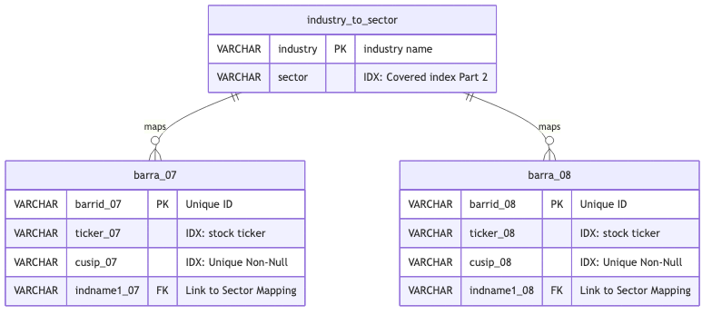

#+TITLE: Barra Factor Model Data Documentation
#+DATE: <2026-04-17 Fri>
#+FILETAGS: :project2:barra:sqlite:documentation:

* Project Requirements

** Database Documentation
- ERD showing all tables and relationships
- Column naming convention and any modifications
- Data type justifications
- Handling of estimation universe filtering
- NULL handling strategy

** Analysis Report
- Executive summary of risk factor findings
- Beta and risk measure recommendations
- Sector impact analysis
- Visualizations (using Python after SQL retrieval)
- Performance metrics for different query approaches

* Data Dictionary

#+begin_src mermaid :file barra_schema.png
erDiagram
    industry_to_sector ||--o{ barra_07 : "maps"
    industry_to_sector ||--o{ barra_08 : "maps"

    barra_07 {
        VARCHAR barrid_07 PK "Unique ID"
        VARCHAR ticker_07 "IDX: stock ticker"
        VARCHAR cusip_07 "IDX: Unique Non-Null"
        VARCHAR indname1_07 FK "Link to Sector Mapping"
    }

    barra_08 {
        VARCHAR barrid_08 PK "Unique ID"
        VARCHAR ticker_08 "IDX: stock ticker"
        VARCHAR cusip_08 "IDX: Unique Non-Null"
        VARCHAR indname1_08 FK "Link to Sector Mapping"
    }

    industry_to_sector {
        VARCHAR industry PK "industry name"
        VARCHAR sector "IDX: Covered index Part 2"
    }

#+end_src

#+RESULTS:

** table_barra_07
:PROPERTIES:
:TABLE_NAME: barra_07
:SOURCE:   USE3L0712.RSK
:GDOWN_URL: 1Y0WE4cqbZfdNEvFuWIDR_d6oDbHHNkly
:STR_BUFFER_LOGIC: math.ceil(max_len * 1.5)
:END:

|-------------------+-------------+-------------+------------------+------------------------------------------------------------|
| Column            | DTYPE       | Key         | Constraints      | Description                                                |
|-------------------+-------------+-------------+------------------+------------------------------------------------------------|
| barrid_07         | VARCHAR(11) | PKEY        | NOT NULL         | barra id                                                   |
| ticker_07         | VARCHAR(9)  | IDX         |                  | stock ticker                                               |
| cusip_07          | VARCHAR(12) | IDX         | UNIQUE, NOT NULL | unique instrument ID                                       |
| name_07           | VARCHAR(50) | -           | -                | name of stock                                              |
| hbta_07           | FLOAT       | -           | -                | Historical Beta                                            |
| beta_07           | FLOAT       | -           | -                | Predicted Beta                                             |
| srisk_pct_07      | FLOAT       | -           | -                | Systematic Risk (%)                                        |
| trisk_pct_07      | FLOAT       | -           | -                | Total Risk (%)                                             |
| voltilty_07       | FLOAT       | -           | -                | Volatility Factor                                          |
| momentum_07       | FLOAT       | -           | -                | Momentum Factor                                            |
| size_07           | FLOAT       | -           | -                | Size Factor                                                |
| sizenonl_07       | FLOAT       | -           | -                | SIze Non linearity [log] Factor                            |
| tradeact_07       | FLOAT       | -           | -                | Trading Volume Factor                                      |
| growth_07         | FLOAT       | -           | -                | Growth Factor                                              |
| earnyld_07        | FLOAT       | -           | -                | Earnings Yield Factor                                      |
| value_07          | FLOAT       | -           | -                | Value Factor                                               |
| earnvar_07        | FLOAT       | -           | -                | Earnings Variability Factor                                |
| leverage_07       | FLOAT       | -           | -                | Leverage Factor                                            |
| currsen_07        | FLOAT       | -           | -                | Currency Sensitivity Factor                                |
| yield_07          | FLOAT       | -           | -                | Yield Factor                                               |
| nonestu_07        | BOOLEAN     | -           | -                | In estimation universe                                     |
| indname1_07       | VARCHAR(12) | Foreign Key | -                | industry name, Mapped to table_industry_to_sector.industry |
| ind1_07           | INTEGER     | -           | -                | industry code                                              |
| wgt1_pct_07       | INTEGER     | -           | -                | industry weight if operating in more than one industry     |
| indname2_07       | VARCHAR(12) | -           | -                | 2nd industry name                                          |
| ind2_07           | INTEGER     | -           | -                | 2nd industry code                                          |
| wgt2_pct_07       | INTEGER     | -           | -                | 2nd industry weight                                        |
| indname3_07       | VARCHAR(12) | -           | -                | 3rd industry name                                          |
| ind3_07           | INTEGER     | -           | -                | 3rd industry code                                          |
| wgt3_pct_07       | INTEGER     | -           | -                | 3rd industry weight                                        |
| indname4_07       | VARCHAR(12) | -           | -                | 4th industry name                                          |
| ind4_07           | INTEGER     | -           | -                | 4th industry code                                          |
| wgt4_pct_07       | INTEGER     | -           | -                | 4th industry weight                                        |
| indname5_07       | VARCHAR(12) | -           | -                | 5th industry name                                          |
| ind5_07           | INTEGER     | -           | -                | 5th industry code                                          |
| wgt5_pct_07       | INTEGER     | -           | -                | 5th industry weight                                        |
| price_07          | FLOAT       | -           | -                | Stock Price                                                |
| capitalization_07 | FLOAT       | -           | -                | Market Capitalization (Outstanding Shares * Price)         |
| yld_pct_07        | FLOAT       | -           | -                | Dividend Yield Factor                                      |
| sap500_07         | BOOLEAN     | -           | -                | S&P 500 Membership                                         |
| sapval_07         | BOOLEAN     | -           | -                | S&P Value Membership                                       |
| sapgro_07         | BOOLEAN     | -           | -                | S&P Growth Membership                                      |
| midcap_07         | BOOLEAN     | -           | -                | Middle Market Cap Value (~ 2BN - 10BN)                     |
| midval_07         | BOOLEAN     | -           | -                | Middle Market Cap Value membership                         |
| midgro_07         | BOOLEAN     | -           | -                | Middle Market Cap Growth membership                        |
| sc600_07          | BOOLEAN     | -           | -                | S&P Small Cap Membership                                   |
| scval_07          | BOOLEAN     | -           | -                | S&P Small Cap Value Membership                             |
| scgro_07          | BOOLEAN     | -           | -                | S&P Small Cap Growth Membership                            |
| e3estu_07         | BOOLEAN     | -           | -                | Barra Estimation Universe Membership                       |
| created_on        | DATETIME    | -           | -                | insert timestamp                                           |
| updated_on        | DATETIME    | -           | -                | last update time                                           |

** table_barra_08
:PROPERTIES:
:TABLE_NAME: barra_08
:SOURCE:   USE3L0812.RSK
:STR_BUFFER_LOGIC: math.ceil(max_len * 1.5)
:GDOWN_URL: 1Z3vdd5m8uoB4whomq92DQbZHJiKYJc0v
:END:

|-------------------+------------------+-------------+--------------------+------------------------------------------------------------|
| Column            | DTYPE            | Key         | Constraints        | Description                                                |
|-------------------+------------------+-------------+--------------------+------------------------------------------------------------|
| barrid_08         | VARCHAR(11)      | PKEY        | NOT NULL           | barra id                                                   |
| ticker_08         | VARCHAR(9)       | IDX         |                    | stock ticker                                               |
| cusip_08          | VARCHAR(12)      | IDX         | UNIQUE, NOT NULL   | unique instrument ID                                       |
| name_08           | VARCHAR(50)      | -           | -                  | name of stock                                              |
| hbta_08           | FLOAT            | -           | -                  | Historical Beta                                            |
| beta_08           | FLOAT            | -           | -                  | Predicted Beta                                             |
| srisk_pct_08      | FLOAT            | -           | -                  | Systematic Risk (%)                                        |
| trisk_pct_08      | FLOAT            | -           | -                  | Total Risk (%)                                             |
| voltilty_08       | FLOAT            | -           | -                  | Volatility Factor                                          |
| momentum_08       | FLOAT            | -           | -                  | Momentum Factor                                            |
| size_08           | FLOAT            | -           | -                  | Size Factor                                                |
| sizenonl_08       | FLOAT            | -           | -                  | SIze Non linearity [log] Factor                            |
| tradeact_08       | FLOAT            | -           | -                  | Trading Volume Factor                                      |
| growth_08         | FLOAT            | -           | -                  | Growth Factor                                              |
| earnyld_08        | FLOAT            | -           | -                  | Earnings Yield Factor                                      |
| value_08          | FLOAT            | -           | -                  | Value Factor                                               |
| earnvar_08        | FLOAT            | -           | -                  | Earnings Variability Factor                                |
| leverage_08       | FLOAT            | -           | -                  | Leverage Factor                                            |
| currsen_08        | FLOAT            | -           | -                  | Currency Sensitivity Factor                                |
| yield_08          | FLOAT            | -           | -                  | Yield Factor                                               |
| nonestu_08        | BOOLEAN          | -           | -                  | In estimation universe                                     |
| indname1_08       | VARCHAR(12)      | Foreign Key | -                  | industry name, Mapped to table_industry_to_sector.industry |
| ind1_08           | INTEGER          | -           | -                  | industry code                                              |
| wgt1_pct_08       | INTEGER          | -           | -                  | industry weight if operating in more than one industry     |
| indname2_08       | VARCHAR(12)      | -           | -                  | 2nd industry name                                          |
| ind2_08           | INTEGER          | -           | -                  | 2nd industry code                                          |
| wgt2_pct_08       | INTEGER          | -           | -                  | 2nd industry weight                                        |
| indname3_08       | VARCHAR(12)      | -           | -                  | 3rd industry name                                          |
| ind3_08           | INTEGER          | -           | -                  | 3rd industry code                                          |
| wgt3_pct_08       | INTEGER          | -           | -                  | 3rd industry weight                                        |
| indname4_08       | VARCHAR(12)      | -           | -                  | 4th industry name                                          |
| ind4_08           | INTEGER          | -           | -                  | 4th industry code                                          |
| wgt4_pct_08       | INTEGER          | -           | -                  | 4th industry weight                                        |
| indname5_08       | VARCHAR(12)      | -           | -                  | 5th industry name                                          |
| ind5_08           | INTEGER          | -           | -                  | 5th industry code                                          |
| wgt5_pct_08       | INTEGER          | -           | -                  | 5th industry weight                                        |
| price_08          | FLOAT            | -           | -                  | Stock Price                                                |
| capitalization_08 | FLOAT            | -           | -                  | Market Capitalization (Outstanding Shares * Price)         |
| yld_pct_08        | FLOAT            | -           | -                  | Dividend Yield Factor                                      |
| sap500_08         | BOOLEAN          | -           | -                  | S&P 500 Membership                                         |
| sapval_08         | BOOLEAN          | -           | -                  | S&P Value Membership                                       |
| sapgro_08         | BOOLEAN          | -           | -                  | S&P Growth Membership                                      |
| midcap_08         | BOOLEAN          | -           | -                  | Middle Market Cap Value (~ 2BN - 10BN)                     |
| midval_08         | BOOLEAN          | -           | -                  | Middle Market Cap Value membership                         |
| midgro_08         | BOOLEAN          | -           | -                  | Middle Market Cap Growth membership                        |
| sc600_08          | BOOLEAN          | -           | -                  | S&P Small Cap Membership                                   |
| scval_08          | BOOLEAN          | -           | -                  | S&P Small Cap Value Membership                             |
| scgro_08          | BOOLEAN          | -           | -                  | S&P Small Cap Growth Membership                            |
| e3estu_08         | BOOLEAN          | -           | -                  | Barra Estimation Universe Membership                       |
| created_on        | DATETIME         | -           | -                  | insert timestamp                                           |
| updated_on        | DATETIME         | -           | -                  | last update time                                           |

** table_industry_to_sector
:PROPERTIES:
:SOURCE:   barra_handbook:: Appdx B
:TABLE_NAME: industry_to_sector
:END:

|------------+-------------+------+-------------+--------------------------------|
| Column     | DTYPE       | Key  | Constraints | Description                    |
|------------+-------------+------+-------------+--------------------------------|
| industry   | VARCHAR(23) | PKEY | NOT NULL    | industry name maps to indname1 |
| sector     | VARCHAR(23) | -    | NOT NULL    | sector                         |
| created_on | DATETIME,   | -    | -           | row creation time              |
| updated_on | DATETIME,   | -    | -           | last updated time              |
|------------+-------------+------+-------------+--------------------------------|

* Ingestion Lineage Log
** [1] Initial Load of Data
   - *NULL-HANDLING:* Converted sentinels (coded as -999) to pandas.nan
   - *Transformation:* cleaned all columns of leading/trailing whitespaces
   - *Transformation:* str.strip() on barrid
   - *Transformation:* replaced invalid chars (%: pct)
   - *Transformation:* str.lower() all columns
   - *UNIVERSE DROPS:* Dropped BUD ticker because due to merger was delisted, not for risk reasons
   - *UPDATE:* barra_08.NWSA --> barra_08.NWS.A to match 2007 ticker post merger
     
